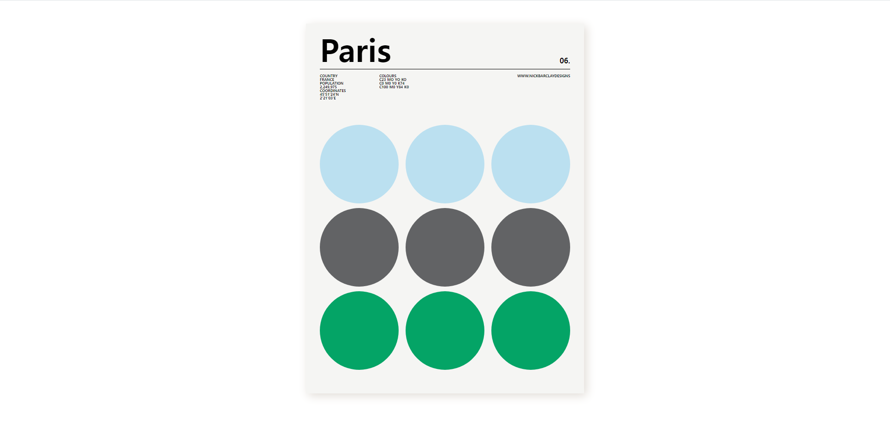

# 연습 01

**flexbox를 사용하여 포스터 만들기**

1. 결과물

- 레플 링크: https://replit.com/@papepopepe1/CSSMASTER01

- 완성 모습
  

<br/>

2. 아쉬운 점

- **css에 재사용되는 코드가 많다**
- 해결방안: css를 클래스로 빼낼 수 있는 방법 생각하기 (변수로 대체하거나)

<br/>

3. 코드

- <details>
    <summary>html 코드</summary>

  ```html
  <!DOCTYPE html>
  <html>
    <head>
      <meta charset="utf-8" />
      <meta name="viewport" content="width=device-width" />
      <title>repl.it</title>
      <link href="style.css" rel="stylesheet" type="text/css" />
    </head>

    <body>
      <div class="background-paper">
        <div class="container">
          <div class="title">
            <div class="title-name">Paris</div>
            <div class="title-number">06.</div>
          </div>
          <div class="separate-line"></div>
          <div class="content-box">
            <div class="country-box">
              <p>COUNTRY</p>
              <p>FRANCE</p>
              <p>POPULATION</p>
              <p>2,249,975</p>
              <p>COORDINATES</p>
              <p>45'51'24'N</p>
              <p>2'21'03'E</p>
            </div>
            <div class="color-box">
              <p>COLOURS</p>
              <p>C23 MO YO KO</p>
              <p>C0 M0 Y0 K74</p>
              <p>C100 M0 Y84 K0</p>
            </div>
            <div class="source-box">
              <p>WWW.NICKBARCLAYDESIGNS</p>
            </div>
          </div>
          <div class="circles-box">
            <div class="blue-circles">
              <div></div>
              <div></div>
              <div></div>
            </div>
            <div class="black-circles">
              <div></div>
              <div></div>
              <div></div>
            </div>
            <div class="green-circles">
              <div></div>
              <div></div>
              <div></div>
            </div>
          </div>
        </div>
      </div>
    </body>
  </html>
  ```

- <details>
    <summary>cssl 코드</summary>

  ```css
  @import url('https://cdnjs.cloudflare.com/ajax/libs/meyer-reset/2.0/reset.min.css');

  body {
    background-color: white;
    padding: 50px 25px;
    max-width: 770px;
    width: 100%;
    margin: 0 auto;

    display: flex;
    justify-content: center;
    align-items: center;
  }

  .background-paper {
    background-color: #f5f5f3;
    width: 600px;
    height: 800px;
    box-shadow: 5px 5px 20px #e1dcd6;
  }

  .container {
    width: 90%;
    display: flex;
    padding-left: 5%;
    flex-direction: column;
  }

  .title {
    display: flex;
    justify-content: space-between;
    align-items: flex-end;
    margin-top: 20px;
  }

  .title-name {
    font-size: 68px;
    font-weight: bold;
  }

  .title-number {
    font-weight: bold;
  }

  .separate-line {
    background-color: black;
    height: 1px;
    margin-top: 10px;
    margin-bottom: 10px;
  }

  .content-box {
    display: flex;
    justify-content: space-between;
  }

  .color-box {
    margin-left: -30%;
  }

  .content-box p {
    font-size: 8px;
    font-weight: 600;
  }

  .circles-box {
    margin-top: 10%;
    height: 70%;
  }

  .blue-circles,
  .black-circles,
  .green-circles {
    display: flex;
    justify-content: space-between;
    margin-bottom: 10px;
  }

  .blue-circles div {
    width: 170px;
    height: 170px;
    border-radius: 100%;
    background-color: #bbe0f0;
  }

  .black-circles div {
    width: 170px;
    height: 170px;
    border-radius: 100%;
    background-color: #626365;
  }

  .green-circles div {
    width: 170px;
    height: 170px;
    border-radius: 100%;
    background-color: #04a466;
  }
  ```
