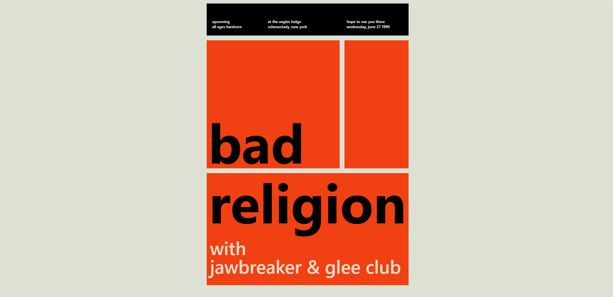

# 연습 02

**grid를 사용하여 포스터 만들기**

1. 결과물

- 레플 링크: https://replit.com/@papepopepe1/CSSMASTER02

- 완성 모습
  

<br />

2. 아쉬운 점

- **grid에 대해서 자세히 모르는 것 같다**
- 해결방안: 티스토리에 조금 더 정리해서 업로드한 뒤, 해당 리드미에 링크 걸기

<br />

3. 코드

- <details>
      <summary>html 코드</summary>

  ```html
  <!DOCTYPE html>
  <html>
    <head>
      <meta charset="utf-8" />
      <meta name="viewport" content="width=device-width" />
      <title>repl.it</title>
      <link href="style.css" rel="stylesheet" type="text/css" />
    </head>

    <body>
      <div class="poster">
        <div class="header">
          <span class="upcoming">
            upcoming
            <br />
            all ages hardcore
          </span>
          <span class="newyork">
            at the eagles lodge
            <br />
            schenectady, new york
          </span>
          <span class="wednesday">
            hope to see you there
            <br />
            wednesday, june 27 1990
          </span>
        </div>
        <div class="content">
          <span class="bad">bad</span>
        </div>
        <div class="aside"></div>
        <div class="footer">
          <span class="religion">religion</span>
          <span class="with">
            with
            <br />
            jawbreaker & glee club
          </span>
        </div>
      </div>
    </body>
  </html>
  ```

  </details>

- <details>
    <summary>css 코드</summary>

  ```css
  @import url('https://cdnjs.cloudflare.com/ajax/libs/meyer-reset/2.0/reset.min.css');

  body {
    background-color: #dde1d4;
    padding: 15px;
    font-family: -apple-system, BlinkMacSystemFont, 'Segoe UI', Roboto, Oxygen,
      Ubuntu, Cantarell, 'Open Sans', 'Helvetica Neue', sans-serif;
    max-width: 650px;
    width: 100%;
    height: 100vh;
    margin: 0 auto;

    display: flex;
    justify-content: center;
    align-items: center;
  }

  .poster {
    display: grid;
    gap: 15px;
    grid-template-columns: repeat(3, 200px);
    grid-template-rows: 100px 400px 350px;
    grid-template-areas:
      'header header header'
      'content content aside'
      'footer footer footer';
  }

  .header {
    background-color: black;
    grid-area: header;
    display: grid;
    grid-template-columns: 1fr 2fr 2fr;
    color: white;
    font-size: 12px;

    align-items: flex-end;
    justify-items: center;
    padding-bottom: 20px;
    line-height: 16px;
    font-weight: 600;
  }

  .content {
    background-color: #f14011;
    grid-area: content;
    display: grid;
  }

  .content .bad {
    text-align: left;
    align-self: flex-end;
    font-size: 170px;
    font-weight: bold;
    margin-left: 5px;
  }

  .aside {
    background-color: #f14011;
    grid-area: aside;
  }

  .footer {
    background-color: #f14011;
    grid-area: footer;
    display: grid;
    grid-template-rows: repeat(2, 50%);
  }

  .footer .religion {
    font-size: 170px;
    font-weight: bold;
    text-align: center;
    align-self: center;
  }

  .footer .with {
    align-self: center;
    margin-left: 10px;
    color: #e0dcc9;
    font-size: 3vmax;
    font-weight: 500;
  }
  ```

</details>
