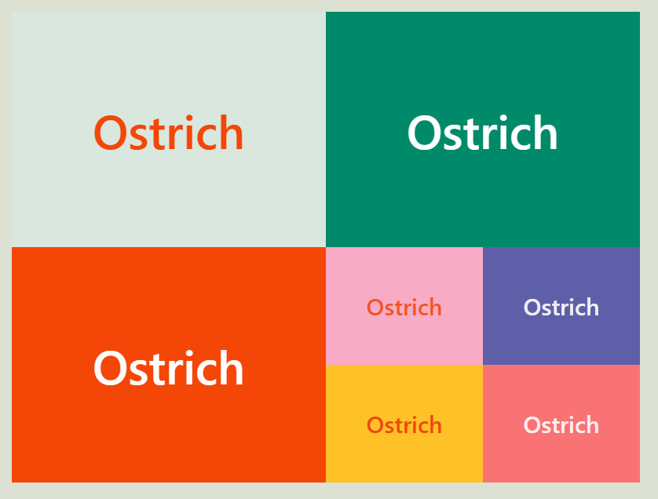

# 연습 03

**grid - 정렬을 응용하여 포스터 만들기**

1. 결과물

- 레플 링크: https://replit.com/@papepopepe1/CSSMASTER03

- 완성 모습
  

<br />

2. 아쉬운 점

- **grid에 대해서 자세히 모르는 것 같다**
- 해결방안: 티스토리에 조금 더 정리해서 업로드한 뒤, 해당 리드미에 링크 걸기

<br />

3. 코드

- <details>
        <summary>html 코드</summary>

  ```html
  <!DOCTYPE html>
  <html>
    <head>
      <meta charset="utf-8" />
      <meta name="viewport" content="width=device-width" />
      <title>repl.it</title>
      <link href="style.css" rel="stylesheet" type="text/css" />
    </head>

    <body>
      <div class="grid-container">
        <div class="grid-item1">Ostrich</div>
        <div class="grid-item2">Ostrich</div>
        <div class="grid-item3">Ostrich</div>
        <div class="grid-item-small-container">
          <div class="grid-item-small1">Ostrich</div>
          <div class="grid-item-small2">Ostrich</div>
          <div class="grid-item-small3">Ostrich</div>
          <div class="grid-item-small4">Ostrich</div>
        </div>
      </div>
    </body>
  </html>
  ```

  </details>

- <details>
    <summary>css 코드</summary>

  ```css
  @import url('https://cdnjs.cloudflare.com/ajax/libs/meyer-reset/2.0/reset.min.css');

  body {
    background-color: #dde1d4;
    padding: 15px;
    font-family: -apple-system, BlinkMacSystemFont, 'Segoe UI', Roboto, Oxygen,
      Ubuntu, Cantarell, 'Open Sans', 'Helvetica Neue', sans-serif;
    width: 100%;
    height: 100vh;
    margin: 0 auto;

    display: flex;
  }

  .grid-container {
    display: grid;
    width: 800px;
    height: 600px;

    grid-template-columns: repeat(2, 1fr);
    grid-template-rows: repeat(2, 1fr);
  }

  .grid-container div {
    font-size: 60px;
    font-weight: 600;
    display: grid;
    place-items: center center;
  }

  .grid-item1 {
    background-color: #dae7de;
    color: #f44607;
  }

  .grid-item2 {
    background-color: #008a69;
    color: #fdfefe;
  }

  .grid-item3 {
    background-color: #f44607;
    color: #fefdfc;
  }

  .grid-item-small-container {
    display: grid;

    width: 400px;
    height: 300px;

    grid-template-columns: repeat(2, 1fr);
    grid-template-rows: repeat(2, 1fr);
  }

  .grid-item-small-container div {
    font-size: 30px;
    font-weight: 600;

    width: 100%;
    height: 100%;

    display: grid;
    place-items: center center;
  }

  .grid-item-small1 {
    background-color: #f7abc5;
    color: #f45422;
  }

  .grid-item-small2 {
    background-color: #5f5fa9;
    color: #f0eff5;
  }

  .grid-item-small3 {
    background-color: #ffc128;
    color: #f1460a;
  }

  .grid-item-small4 {
    background-color: #f97374;
    color: #fdeeef;
  }
  ```

</details>
