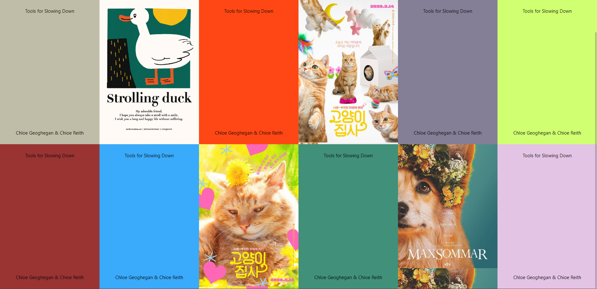

# 연습 04

**grid - 정렬을 응용하여 반응형 포스터 만들기**

1. 결과물

- 레플 링크: https://replit.com/@papepopepe1/CSSMASTER04

- 완성 모습 

2. 소감

- grid를 한 번 정리하고 나니, 수월하게 과제할 수 있었다.

3. 소스코드

- <details>
          <summary>html 코드</summary>

  ```html
    <!DOCTYPE html>
    <html></html>
    <head>
    <meta charset="utf-8">
    <meta name="viewport" content="width=device-width">
    <title>repl.it</title>
    <link href="style.css" rel="stylesheet" type="text/css" />
    </head>

    <body>
    <header>Foreward, Contributors</header>
    <div class="grid-container">
        <div class="grid-area area">
        <span>Tools for Slowing Down</span>
        <span>Chloe Geoghegan & Chioe Reith</span>
        </div>
        <div class="grid-area area"></div>
        <div class="grid-area area">
        <span>Tools for Slowing Down</span>
        <span>Chloe Geoghegan & Chioe Reith</span>
        </div>
        <div class="grid-area area"></div>
        <div class="grid-area area">
        <span>Tools for Slowing Down</span>
        <span>Chloe Geoghegan & Chioe Reith</span>
        </div>
        <div class="grid-area area">
        <span>Tools for Slowing Down</span>
        <span>Chloe Geoghegan & Chioe Reith</span>
        </div>
        <div class="grid-area area">
        <span>Tools for Slowing Down</span>
        <span>Chloe Geoghegan & Chioe Reith</span>
        </div>
        <div class="grid-area area">
        <span>Tools for Slowing Down</span>
        <span>Chloe Geoghegan & Chioe Reith</span>
        </div>
        <div class="grid-area area"></div>
        <div class="grid-area area">
        <span>Tools for Slowing Down</span>
        <span>Chloe Geoghegan & Chioe Reith</span>
        </div>
        <div class="grid-area area"></div>
        <div class="grid-area area">
        <span>Tools for Slowing Down</span>
        <span>Chloe Geoghegan & Chioe Reith</span>
        </div>
    </div>
    </body>

    </html>
  ```

  </details>

- <details>
    <summary>css 코드</summary>

  ```css
  @import url('https://cdnjs.cloudflare.com/ajax/libs/meyer-reset/2.0/reset.min.css');

  body {
    font-family: -apple-system, BlinkMacSystemFont, 'Segoe UI', Roboto, Oxygen,
      Ubuntu, Cantarell, 'Open Sans', 'Helvetica Neue', sans-serif;
    width: 100%;
    height: 100vh;
  }

  header {
    display: grid;
    font-size: 3vmax;
    justify-items: center;
    align-items: center;
    padding: 30px 0;
  }

  .grid-container {
    height: 100vh;
    display: grid;
    grid-template-columns: repeat(auto-fill, minmax(300px, 1fr));
    grid-template-rows: repeat(auto-fill, minmax(400px, 1fr));
    grid-auto-rows: 400px;
  }

  .grid-area {
    display: flex;
    flex-direction: column;
    justify-content: space-between;
    align-items: center;
    padding: 30px 0;
  }

  .area:nth-child(1) {
    background-color: #bfbda7;
  }

  .area:nth-child(2) {
    background-image: url('https://contents.sixshop.com/uploadedFiles/75691/product/image_1682499362496.jpg');
    background-size: contain;
  }

  .area:nth-child(3) {
    background-color: #fe4714;
  }

  .area:nth-child(4) {
    background-image: url('https://file2.nocutnews.co.kr/newsroom/image/2020/05/29/20200529104903858729_0_710_1018.jpg');
    background-size: contain;
  }

  .area:nth-child(5) {
    background-color: #847e96;
  }

  .area:nth-child(6) {
    background-color: #d0ff71;
  }

  .area:nth-child(7) {
    background-color: #993433;
  }

  .area:nth-child(8) {
    background-color: #3aaafa;
  }

  .area:nth-child(9) {
    background-image: url('https://image.xportsnews.com/contents/images/upload/article/2020/0427/mb_1587950023220552.jpg');
    background-size: contain;
  }

  .area:nth-child(10) {
    background-color: #41907a;
  }

  .area:nth-child(11) {
    background-image: url('https://post-phinf.pstatic.net/MjAyMDAyMDdfMjgx/MDAxNTgxMDUyMjg0MzIw.afllnXeEVBiUYKswRACn7wnLfcWV4E1ceUTiNtYoiWYg.CmnkL9cFt5kCCdQfvmALWpUhhy6S0YSzIDdoGU8rLJ0g.JPEG/maxine-the-corgi-film-poster-07.jpg?type=w800_q75');
    background-size: contain;
  }

  .area:nth-child(12) {
    background-color: #e3c4e5;
  }
  ```

</details>
