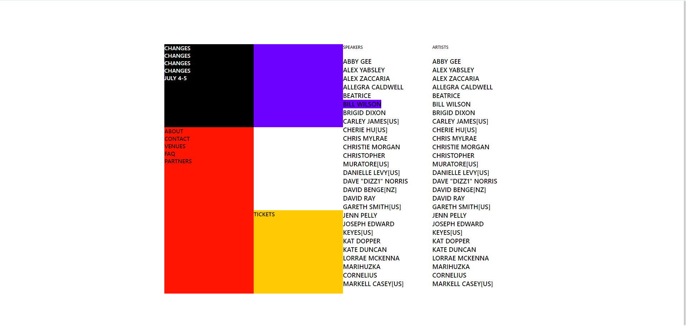

# 연습 05

**자유롭게 포스터 만들기**

1. 결과물

- 레플 링크: https://replit.com/@papepopepe1/CSSMASTER05

- 완성 모습: 

2. 구현 과정

- 좌측의 다양한 색이 있는 부분은 grid로 제작하였습니다.
- 우측의 인물 명단은 두 개의 < section > 을 합쳐 하나의 box로 만들었습니다.

3. 소스코드

- <details>
          <summary>html 코드</summary>

  ```html
  <!DOCTYPE html>
  <html lang="en">
    <head>
      <meta charset="UTF-8" />
      <meta name="viewport" content="width=device-width, initial-scale=1.0" />
      <link rel="stylesheet" href="style.css" />
      <title>CSS Layout Masterclass</title>
    </head>

    <body>
      <main id="container">
        <section class="grid__box">
          <section>
            <span>CHANGES</span>
            <span>CHANGES</span>
            <span>CHANGES</span>
            <span>CHANGES</span>
            <span>JULY 4-5</span>
          </section>
          <section></section>
          <section>
            <span>ABOUT</span>
            <span>CONTACT</span>
            <span>VENUES</span>
            <span>FAQ</span>
            <span>PARTNERS</span>
          </section>
          <section></section>
          <section>
            <span>TICKETS</span>
          </section>
        </section>

        <section id="flex__box">
          <section>
            <span style="font-size: 12px; margin-bottom: 20px;">SPEAKERS</span>
            <span>ABBY GEE</span>
            <span>ALEX YABSLEY</span>
            <span>ALEX ZACCARIA</span>
            <span>ALLEGRA CALDWELL</span>
            <span>BEATRICE</span>
            <span>
              <span style="background-color: #6c01ff;">BILL WILSON</span>
            </span>
            <span>BRIGID DIXON</span>
            <span>CARLEY JAMES[US]</span>
            <span>CHERIE HU[US]</span>
            <span>CHRIS MYLRAE</span>
            <span>CHRISTIE MORGAN</span>
            <span>CHRISTOPHER</span>
            <span>MURATORE[US]</span>
            <span>DANIELLE LEVY[US]</span>
            <span>DAVE "DIZZ1" NORRIS</span>
            <span>DAVID BENGE[NZ]</span>
            <span>DAVID RAY</span>
            <span>GARETH SMITH[US]</span>
            <span>JENN PELLY</span>
            <span>JOSEPH EDWARD</span>
            <span>KEYES[US]</span>
            <span>KAT DOPPER</span>
            <span>KATE DUNCAN</span>
            <span>LORRAE MCKENNA</span>
            <span>MARIHUZKA</span>
            <span>CORNELIUS</span>
            <span>MARKELL CASEY[US]</span>
          </section>
          <section>
            <span style="font-size: 12px; margin-bottom: 20px;">ARTISTS</span>
            <span>ABBY GEE</span>
            <span>ALEX YABSLEY</span>
            <span>ALEX ZACCARIA</span>
            <span>ALLEGRA CALDWELL</span>
            <span>BEATRICE</span>
            <span>BILL WILSON</span>
            <span>BRIGID DIXON</span>
            <span>CARLEY JAMES[US]</span>
            <span>CHERIE HU[US]</span>
            <span>CHRIS MYLRAE</span>
            <span>CHRISTIE MORGAN</span>
            <span>CHRISTOPHER</span>
            <span>MURATORE[US]</span>
            <span>DANIELLE LEVY[US]</span>
            <span>DAVE "DIZZ1" NORRIS</span>
            <span>DAVID BENGE[NZ]</span>
            <span>DAVID RAY</span>
            <span>GARETH SMITH[US]</span>
            <span>JENN PELLY</span>
            <span>JOSEPH EDWARD</span>
            <span>KEYES[US]</span>
            <span>KAT DOPPER</span>
            <span>KATE DUNCAN</span>
            <span>LORRAE MCKENNA</span>
            <span>MARIHUZKA</span>
            <span>CORNELIUS</span>
            <span>MARKELL CASEY[US]</span>
          </section>
        </section>
      </main>
    </body>
  </html>
  ```

  </details>

- <details>
    <summary>css 코드</summary>

  ```css
  body {
    display: flex;
    justify-content: center;
    align-items: center;
    height: 100vh;
  }

  #container {
    display: flex;
    flex-direction: row;
    width: 1000px;
    height: 700px;
    background-color: beige;
  }

  .grid__box {
    width: 50%;
    height: 100%;
    background-color: antiquewhite;
    display: grid;
    grid-template-columns: 1fr 1fr;
    grid-template-rows: 1fr 1fr 1fr;
  }

  .grid__box section:nth-of-type(1) {
    display: flex;
    flex-direction: column;
    background-color: black;
    color: white;
    font-family: 'Segoe UI', Tahoma, Geneva, Verdana, sans-serif;
    font-weight: 600;
  }

  .grid__box section:nth-of-type(2) {
    background-color: #6c01ff;
  }

  .grid__box section:nth-of-type(3) {
    display: flex;
    flex-direction: column;
    background-color: #ff1502;
    grid-row-start: 2;
    grid-row-end: 4;
    font-family: 'Segoe UI', Tahoma, Geneva, Verdana, sans-serif;
    font-weight: 600;
  }

  .grid__box section:nth-of-type(4) {
    background-color: white;
  }

  .grid__box section:nth-of-type(5) {
    font-family: 'Segoe UI', Tahoma, Geneva, Verdana, sans-serif;
    font-weight: 600;
    background-color: #ffc904;
  }

  #flex__box {
    display: flex;
    width: 50%;
    height: 100%;
    background-color: aqua;
  }

  #flex__box section {
    height: 100%;
    width: 50%;
    background-color: white;
    display: flex;
    flex-direction: column;
  }

  #flex__box span {
    font-family: 'Segoe UI', Tahoma, Geneva, Verdana, sans-serif;
    font-weight: 600;
    font-size: 18px;
  }
  ```

  </details>
